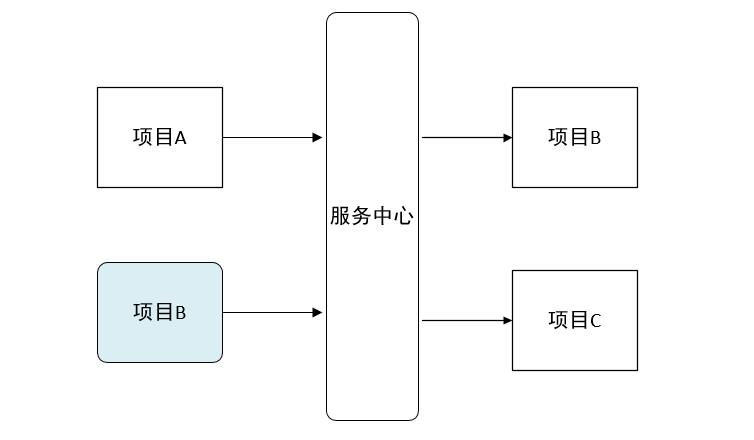

#springcloud(二)：注册中心Eureka
Eureka是Netflix开源的一款提供服务注册和发现的产品，它提供了完整的Service Registry和Service Discovery实现。也是springcloud体系中最重要最核心的组件之一。

##背景介绍
###服务中心
服务中心又称注册中心，管理各种服务功能包括服务的注册、发现、熔断、负载、降级等，比如dubbo admin后台的各种功能。
有了服务中心调用关系会有什么变化，画几个简图来帮忙理解
项目A调用项目B
正常调用项目A请求项目B


有了服务中心之后，任何一个服务都不能直接去掉用，都需要通过服务中心来调用


项目A调用项目B，项目B在调用项目C


这时候调用的步骤就会为两步：第一步，项目A首先从服务中心请求项目B服务器，然后项目B在从服务中心请求项目C服务。


上面的项目只是两三个相互之间的简单调用，但是如果项目超过20个30个呢，在15年底的时候我司分布式的项目就达到了二十几个，画一张图来描述几十个项目之间的相互调用关系全是线条，任何其中的一个项目改动，就会牵连好几个项目跟着重启，巨麻烦而且容易出错。通过服务中心来获取服务你不需要关注你调用的项目IP地址，由几台服务器组成，每次直接去服务中心获取可以使用的服务去调用既可。

由于各种服务都注册到了服务中心，就有了去做很多高级功能条件。比如几台服务提供相同服务来做均衡负载；监控服务器调用成功率来做熔断，移除服务列表中的故障点；监控服务调用时间来对不同的服务器设置不同的权重等等。

#Eureka
Spring Cloud 封装了 Netflix 公司开发的 Eureka 模块来实现服务注册和发现。Eureka 采用了 C-S 的设计架构。Eureka Server 作为服务注册功能的服务器，它是服务注册中心。而系统中的其他微服务，使用 Eureka 的客户端连接到 Eureka Server，并维持心跳连接。这样系统的维护人员就可以通过 Eureka Server 来监控系统中各个微服务是否正常运行。Spring Cloud 的一些其他模块（比如Zuul）就可以通过 Eureka Server 来发现系统中的其他微服务，并执行相关的逻辑。

Eureka由两个组件组成：Eureka服务器和Eureka客户端。Eureka服务器用作服务注册服务器。Eureka客户端是一个java客户端，用来简化与服务器的交互、作为轮询负载均衡器，并提供服务的故障切换支持。Netflix在其生产环境中使用的是另外的客户端，它提供基于流量、资源利用率以及出错状态的加权负载均衡。

用一张图来认识以下：


上图简要描述了Eureka的基本架构，由3个角色组成：

- 1、Eureka Server

提供服务注册和发现
- 2、Service Provider

服务提供方
将自身服务注册到Eureka，从而使服务消费方能够找到
- 3、Service Consumer

服务消费方
从Eureka获取注册服务列表，从而能够消费服务

##集群
###双节点注册中心
首次我们尝试一下双节点的注册中心的搭建。
1、创建application-peer1.properties，作为peer1服务中心的配置，并将serviceUrl指向peer2
```
spring.application.name=spring-cloud-eureka
server.port=8000
eureka.instance.hostname=peer1
```
2、创建application-peer2.properties，作为peer2服务中心的配置，并将serviceUrl指向peer1
```
spring.application.name=spring-cloud-eureka
server.port=8001
eureka.instance.hostname=peer2

eureka.client.serviceUrl.defaultZone=http://peer1:8000/eureka/
```
3、host转换
在hosts文件中加入如下配置
```
127.0.0.1 peer1
127.0.0.1 peer2
```

4、打包启动
依次执行下面命令spring-cloud-eureka
```
#打包
mvn clean package
# 分别以peer1和peeer2 配置信息启动eureka
java -jar cloud-registration-center-0.0.1-SNAPSHOT.jar --spring.profiles.active=peer1
java -jar cloud-registration-center-0.0.1-SNAPSHOT.jar --spring.profiles.active=peer2
```

依次启动完成后，浏览器输入：http://localhost:8000/ 效果图如下：


根据图可以看出peer1的注册中心DS Replicas已经有了peer2的相关配置信息，并且出现在available-replicas中。我们手动停止peer2来观察，发现peer2就会移动到unavailable-replicas一栏中，表示peer2不可用。

到此双节点的配置已经完成。
 
 
 ###eureka集群使用
 在生产中我们可能需要三台或者大于三台的注册中心来保证服务的稳定性，配置的原理其实都一样，将注册中心分别指向其它的注册中心。这里只介绍三台集群的配置情况，其实和双节点的注册中心类似，每台注册中心分别又指向其它两个节点即可，使用application.yml来配置。
 
 application.yml配置详情如下：
 ```
 #---
 spring:
   application:
     name: spring-cloud-eureka
   profiles: peer1
 server:
   port: 8000
 eureka:
   instance:
     hostname: peer1
   client:
     serviceUrl:
       defaultZone: http://peer2:8001/eureka/,http://peer3:8002/eureka/
 ---
 spring:
   application:
     name: spring-cloud-eureka
   profiles: peer2
 server:
   port: 8001
 eureka:
   instance:
     hostname: peer2
   client:
     serviceUrl:
       defaultZone: http://peer1:8000/eureka/,http://peer3:8002/eureka/
 ---
 spring:
   application:
     name: spring-cloud-eureka
   profiles: peer3
 server:
   port: 8002
 eureka:
   instance:
     hostname: peer3
   client:
     serviceUrl:
       defaultZone: http://peer1:8000/eureka/,http://peer2:8001/eureka/
 ```
 分别以peer1、peer2、peer3的配置参数启动eureka注册中心。
 
  ```
  java -jar spring-cloud-eureka-0.0.1-SNAPSHOT.jar --spring.profiles.active=peer1
  java -jar spring-cloud-eureka-0.0.1-SNAPSHOT.jar --spring.profiles.active=peer2
  java -jar spring-cloud-eureka-0.0.1-SNAPSHOT.jar --spring.profiles.active=peer3
  ```
 
 